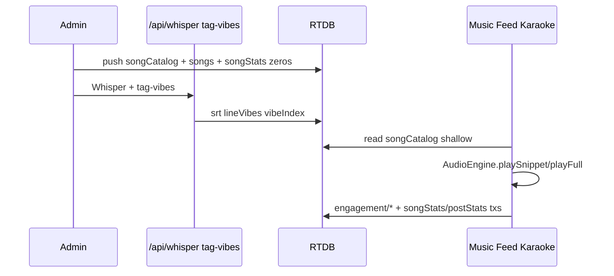

# Margo Target Architecture Spec
**Audio playback & engagement data integrity**  
Version 1.0 — May 2026  
Status: Blueprint (implementation pending)  
Standards: GIANTS WAY · MODERN · PREMIUM · UNIQUE FOR MARGO · LONG TERM · USER EXPERIENCE · CONSISTENCY · VERY LOGICAL · MOBILE FIRST · APP READY

This document is the implementation blueprint derived from the full codebase audit. It replaces ad hoc `new Audio()` usage and fragmented Firebase writes with one engine and one engagement model.

---

# SECTION 1 — Current vs Target

## 1.1 Audio engine

| Dimension | **Current** | **Target** |
|-----------|-------------|------------|
| Instances | 5+ detached `HTMLAudioElement` / `new Audio()` (feed snippet, feed tier-1, music pool Map, `player-store._audio`, karaoke player) | **Exactly one** `<audio>` in the DOM, owned by `AudioEngineProvider` |
| Controller | `lib/player-store.ts` (partial SSOT) + per-page refs | `lib/audio-engine/` module + `components/audio-engine-provider.tsx` |
| Exclusive playback | `registerGlobalAudio` — one callback, last wins | `AudioEngine.play()` always stops previous session; no orphan audio |
| State subscription | `subscribePlayer` for mini-player only | `useAudioEngine()` + `subscribeAudioEngine()` for all surfaces |
| Media Session | Feed tier-1: handlers set React state only; karaoke: wired to `playAudio` ref | All handlers call `engine.play()` / `engine.pause()` on the **same** element |
| Legacy `js/` | Parallel audio/resonate paths | **Not used** by App Router pages; delete or quarantine after migration |

## 1.2 Feed snippet playback

| Dimension | **Current** | **Target** |
|-----------|-------------|------------|
| Component | `SnippetIconButton` in `app/feed/page.tsx` | `FeedSnippetButton` → calls `engine.playSnippet()` |
| Audio | Local `useRef` + `new Audio` per button | No local audio; engine only |
| Lyric window | Client-side match post text → SRT line | `playSnippet({ songId, lineIndex })` — index from post metadata or resolved once at post create |
| Mini player | `stopPlayer()` on end; never `playTrack` — stale UI | Engine updates global state; mini-player visible on feed (optional collapsed) showing active snippet |
| Duration | Local `setTimeout` | Engine snippet timer (single source) |

## 1.3 Music page snippet playback

| Dimension | **Current** | **Target** |
|-----------|-------------|------------|
| Component | `LyricBoard.playSnippet` in `app/music/page.tsx` | `LyricCard` → `engine.playSnippet()` |
| Pool | `Map<songId, Audio>` preloaded; `src=''` on pause breaks pool | Engine preloads **URLs** in a `Map<songId, string>` (metadata only), one element plays; viewport-driven `warmUrls()` with centralized IntersectionObserver warming and a lookahead of 3 cards |
| Store sync | `playTrack({ audioElement })` + duplicate timers | `engine.playSnippet()` only — no `audioElement` passthrough |
| Queue | `setLyricQueue` resets index; `registerLyricQueue` unused | `engine.setQueue(moments, currentIndex)` with stable index |
| lineVibes | Parsed from `songs/{id}.srt` + `lineVibes` at runtime | Unchanged data source; playback via engine |

## 1.4 Mini player

| Dimension | **Current** | **Target** |
|-----------|-------------|------------|
| File | `components/mini-player.tsx` | Same file; consumes `useAudioEngine()` |
| Hidden routes | `/feed`, `/music/player` | Hidden only on `/music/player` (immersive). **Visible on feed** when `state.mode !== 'idle'` |
| Prev/next | `playTrack(moment)` creates **new** Audio | `engine.queuePrev()` / `engine.queueNext()` — same element, new snippet bounds |
| Seek | `seekPlayer(pct)` uses full file duration for snippets | `engine.seekSnippet(pct)` or disabled for snippet mode; full seek only in `mode: 'full'` |

## 1.5 Karaoke / music player

| Dimension | **Current** | **Target** |
|-----------|-------------|------------|
| File | `app/music/player/page.tsx` | `KaraokePlayerView` + `engine.playFull({ songId, startAt? })` |
| Audio | Local `audioRef` + `new Audio` | No local audio; engine `mode: 'full'` |
| Autoplay | `songId` effect sets `isPlaying(true)` before lyrics load; effect deps omit `song.audioUrl` | `engine.playFull` when `song.audioUrl` + lyrics ready (or explicit user tap); `?au=` warms cache only |
| Lyrics sync | `timeupdate` → `currentLyricIndex` in page | Page subscribes to `engine.currentTime`; scroll logic unchanged |
| Play count | Inside `playAudio` on first play | `EngagementService.recordPlay()` from engine at threshold (Section 3) |
| Navigation | `router.push` with `&au=` | `router.push` with `id` only; engine handles buffer via preload API |

## 1.6 Cross-surface coordination

| Dimension | **Current** | **Target** |
|-----------|-------------|------------|
| Mechanism | `registerGlobalAudio` + partial `stopPlayer` | `AudioEngine.play*` always calls internal `stopCurrent()` |
| Double audio | Common (feed + board + mini next) | **Impossible by construction** — one element |
| Cross-tab | None | Best-effort: `BroadcastChannel('margo-audio')` pause others (P2 enhancement); P0 is single-tab |

## 1.7 Play count logic

| Dimension | **Current** | **Target** |
|-----------|-------------|------------|
| Where | Karaoke only; first `play()` per page mount | **Full karaoke only** (product decision); optional future: weighted snippet listens |
| Threshold | None | **≥ 30 seconds** of continuous play OR **≥ 50%** of track duration (whichever is smaller cap) |
| Dedup | `songPlays/{songId}/{username}` + reset on remount | `engagement/plays/{songId}/{sessionId}` + session survives navigation |
| Write | `set` then `runTransaction` on `songs/.../plays` | Single Cloud Function or atomic multi-path update (Section 3) |
| Display | `songs.plays` on song cards | `songStats/{songId}.plays` (read-only aggregate) |

## 1.8 Resonate logic

| Dimension | **Current** | **Target** |
|-----------|-------------|------------|
| Post | `analytics/{postId}/resonates/{uid}` | Same path (canonical) |
| Song | `songResonates/{songId}/{uid}` separate tree | `engagement/resonates/songs/{songId}/{uid}` + `songStats.resonateCount` |
| Echo | `analytics/{echoId}/resonates/{uid}` (orphan from echo node) | `posts/{postId}/echoes/{echoId}/resonates/{uid}` only |
| Mirror | Feed also mirrors to `songResonates` async | One write path; song aggregate updated by rules/function |
| Rate limit | None | Client debounce 400ms + server rules max 10 toggles/min/uid |

## 1.9 Echo / Lyric Back counts

| Dimension | **Current** | **Target** |
|-----------|-------------|------------|
| Storage | `posts/{postId}/echoes/{echoId}` | Unchanged |
| Count display | Echo UI reads `echo.resonates` (empty); feed trending reads `analytics.echoes` (never written) | `postStats/{postId}.echoCount` + live listener on `echoes` for UI |
| Realtime | `useEchoes` per post | Same hook; count from `postStats` or `onValue` length |

## 1.10 Trending algorithm inputs

| Dimension | **Current** | **Target** |
|-----------|-------------|------------|
| Formula | `(views * 1) + (resonates * 4) + (echoes * 5)` from `analytics` node | `(views * 1) + (resonateCount * 4) + (echoCount * 5)` from `postStats/{postId}` |
| Views | Never incremented in Next | `postStats.views` on first qualified impression |
| Echoes | Always 0 in trending | `postStats.echoCount` maintained on echo push/remove |

## 1.11 Firebase data model (summary)

| Dimension | **Current** | **Target** |
|-----------|-------------|------------|
| Songs | Full tree listener; counters on `songs/{id}` | Shallow catalog + `songStats/{id}` + heavy fields lazy-loaded |
| Analytics | Monolithic `analytics/` listener on feed | Scoped listeners per post/song |
| Identity | `localStorage.margoAnonName` sanitized | `margoSessionId` (persistent) + `margoAnonName` (display) |
| Index | `vibeIndex/` (admin) | Keep; add `songCatalog/`, `postStats/` |

---

# SECTION 2 — Single AudioEngine Design

## 2.1 Location in codebase

```
lib/audio-engine/
  types.ts              — PlaybackMode, PlayRequest, AudioEngineState
  engine.ts             — Core singleton logic (testable, no React)
  media-session.ts      — Media Session API wiring
  snippet-resolver.ts   — SRT line index → start/end seconds
  preload-cache.ts      — URL prefetch hints, fixed POOL_SIZE = 6, LRU warm pool, warmUrls() batch helper

components/
  audio-engine-provider.tsx   — Mounts <audio>, provides React context
  mini-player.tsx             — Refactored consumer (Section 1.4)

hooks/
  useAudioEngine.ts        — Re-export context hook
  useIsPlaying.ts          — current play state
  useIsActiveTrack.ts      — active track selector
  usePlaybackProgress.ts   — mode-aware progress
  useQueueNavigation.ts    — queue navigation helpers
  useAudioCurrentTime.ts   — current playback time
```

**Deprecation:** `lib/player-store.ts` → thin re-export shim during migration, then delete.

**Provider mount:** `app/layout.tsx` wraps `{children}` inside `<AudioEngineProvider>` (above `MiniPlayer`).

## 2.2 State managed

```ts
// lib/audio-engine/types.ts

export type PlaybackMode = 'idle' | 'snippet' | 'full'

export interface SnippetBounds {
  startSec: number
  endSec: number
  lineIndex: number
  lineText: string
}

export interface AudioEngineState {
  mode: PlaybackMode
  playing: boolean
  buffering: boolean
  muted: boolean
  volume: number                    // 0–1
  currentTime: number
  duration: number                  // full file duration
  progress: number                  // 0–100, mode-aware
  songId: string | null
  audioUrl: string | null
  title: string
  artist: string
  artwork: string | null
  vibe: string | null
  snippet: SnippetBounds | null
  queue: LyricMomentQueueItem[]
  queueIndex: number
  error: string | null
  sessionGeneration: number         // increments each play(); stale callback guard
}
```

**Internal (not exposed):** `HTMLAudioElement`, snippet end timer, play qualification timer for engagement, `preloadCache: Map<string, PrefetchState>`.

## 2.3 Public API

```ts
// lib/audio-engine/engine.ts — singleton: export const audioEngine

// Subscription
function subscribeAudioEngine(listener: (state: AudioEngineState) => void): () => void
function getAudioEngineState(): AudioEngineState

// Lifecycle
function attachAudioElement(el: HTMLAudioElement): void  // called by provider only

// Playback — always exclusive
function playSnippet(request: PlaySnippetRequest): Promise<void>
function playFull(request: PlayFullRequest): Promise<void>
function togglePlayPause(): void
function stop(): void                    // idle, clear queue optional flag

// Snippet-specific
function seekSnippetProgress(pct: number): void   // pct within snippet window only
function playFullSeek(sec: number): void

// Queue (music board + mini player)
function setQueue(items: LyricMomentQueueItem[], index: number): void
function queueNext(): void
function queuePrev(): void

// Preload (instant tap — Margo ?au= pattern)
function preloadSong(songId: string, audioUrl: string): void
function warmUrl(audioUrl: string): void     // link rel=preload or engine.load(); batch via warmUrls()

// Preload pool
// POOL_SIZE = 6 with LRU eviction; warmUrls() batch-warms multiple audioUrls at once.
// LyricBoard uses centralized IntersectionObserver warming, debounced scroll updates, and a lookahead of 3 upcoming cards.

// Volume
function setVolume(v: number): void
function toggleMute(): void

// Types
interface PlaySnippetRequest {
  songId: string
  audioUrl: string
  title: string
  artist: string
  artwork?: string | null
  lineIndex: number              // REQUIRED — no fuzzy post-text match in engine
  lineText: string
  startSec: number               // from SRT at call site or resolver
  endSec: number
  vibe?: string | null
  source: 'feed' | 'music-board' | 'mini-player'
}

interface PlayFullRequest {
  songId: string
  audioUrl: string
  title: string
  artist: string
  artwork?: string | null
  startSec?: number              // lyric tap jump
  autoplay?: boolean             // default false until user gesture or tap overlay
  source: 'karaoke' | 'feed-tier1'
}
```

## 2.4 Exclusive playback enforcement

**Rule:** Every `playSnippet` / `playFull` executes:

1. `sessionGeneration++`
2. Clear snippet timer and play-qualification timer
3. If same `audioUrl` already loaded: `pause()`, seek, rebind handlers
4. Else: `pause()`, `src = audioUrl`, `load()`, wait `canplaythrough` (per MARGO audio rules: `readyState >= 3`)
5. Assign handlers with `generation` closure — ignore stale events
6. `play()` only after ready
7. Update `AudioEngineState` → notify subscribers

**No** `registerGlobalAudio`. **No** `audioElement` passthrough.

## 2.5 Media Session wiring

**File:** `lib/audio-engine/media-session.ts`

- On every successful play: `navigator.mediaSession.metadata` from current track
- Handlers:
  - `play` → `audioEngine.togglePlayPause()` if paused, else noop
  - `pause` → `audioEngine.togglePlayPause()` if playing
  - `seekbackward` / `seekforward` → ±10s (full mode only)
  - `previoustrack` / `nexttrack` → `queuePrev` / `queueNext` if queue non-empty
- `navigator.mediaSession.playbackState` synced to `playing`
- **Critical:** handlers invoke engine methods that call `audio.play()` / `audio.pause()` on the DOM element

**iOS:** Keep `playsInline`, user gesture for first `play()`, tap overlay on karaoke until unlocked.

## 2.6 Snippet mode vs full track mode

| | **Snippet mode** | **Full mode** |
|--|------------------|---------------|
| Entry | `playSnippet()` | `playFull()` |
| Start | `currentTime = startSec` | `0` or `startSec` |
| End | Timer at `endSec + 0.3s` pad; pause; `playing=false`; keep `mode='snippet'` for UI | Natural `ended` event |
| Progress bar | `(current - start) / (end - start)` | `current / duration` |
| Seek | Remapped within snippet window | Full timeline |
| Mini player | Shows line text + “Open Karaoke” | Shows title + scrubber |
| Engagement | No play count (v1) | Play qualification timer |

**Snippet max duration cap:** `min((endSec - startSec) + 0.3, 30)` seconds for board auto-rotate compatibility (board may call `stop()` separately).

## 2.7 Karaoke sync

- **Karaoke page does not own audio.** It calls `playFull({ songId, audioUrl, autoplay })` when:
  - User taps play, or
  - Tap overlay dismissed, or
  - `?autoplay=1` after gesture
- **Lyrics:** `useSong(songId)` unchanged; page reads `useAudioEngine().currentTime` for highlight index
- **Jump to line:** `playFullSeek(lyric.start)` + `engine` ensures playing
- **Early audio URL:** `?au=` calls `warmUrl(au)` in provider on mount — not a second player
- **Loading gate:** Do not call `playFull` until `!loading && lyrics.length > 0 && audioUrl` (fixes audio-before-lyrics)

---

# SECTION 3 — Engagement Data Integrity

## 3.1 Identity model

```ts
// lib/engagement/session.ts

function getMargoSessionId(): string
// UUID v4 in localStorage 'margoSessionId' — created once, survives forever
// Used for: play dedup, rate limits, anonymous analytics

function getMargoActorId(): string
// sanitize(localStorage 'margoAnonName' || 'anon') — display + resonate writes
// Future: replace with Firebase anonymous auth uid without breaking paths
```

**Standards:** LONG TERM (real accounts later), APP READY (no PII in sessionId).

## 3.2 Play count rules

**Product rule (v1):** Only **full karaoke** listens count toward `songStats.plays`.

| Rule | Value |
|------|--------|
| Minimum listen | **30 seconds** continuous OR **50%** of track duration if duration < 60s |
| Qualification | Timer starts on first `playing` in `full` mode; cancelled on pause/stop/mode change |
| Dedup key | `engagement/plays/{songId}/{sessionId}` = `{ ts, qualified: true }` |
| Aggregate | `songStats/{songId}/plays` incremented **once** when qualified |
| Atomic write | Prefer **HTTPS callable** `recordQualifiedPlay(songId, sessionId)` — server validates timestamp; client cannot spam transaction |

**Client stub (if no Cloud Function yet):**

```ts
// lib/engagement/plays.ts
async function recordQualifiedPlay(songId: string): Promise<void>
// 1. Check engagement/plays/{songId}/{sessionId}
// 2. If absent: set flag + runTransaction songStats/{songId}/plays
// 3. Never increment songs/{id}/plays directly (legacy field frozen)
// NOTE: `recordQualifiedPlay()` exists in lib/engagement/plays.ts but is not yet wired into AudioEngine; this integration is pending.
```

**Inflation guards:** No increment on `< 30s`; no second increment same session; no increment on snippet; remounting karaoke does not reset `sessionId`.

## 3.3 Resonate rules

**One write path per entity type:**

| Entity | Firebase path | Aggregate |
|--------|---------------|-----------|
| Post | `analytics/{postId}/resonates/{actorId}` = `true` \| deleted | `postStats/{postId}/resonateCount` |
| Song | `engagement/resonates/songs/{songId}/{actorId}` | `songStats/{songId}/resonateCount` |
| Echo | `posts/{parentPostId}/echoes/{echoId}/resonates/{actorId}` | Echo card: live count from children; optional `postStats.echoResonateTotal` later |

**Toggle logic:**

```ts
// lib/engagement/resonate.ts
async function togglePostResonate(postId: string, linkedSongId?: string): Promise<void>
async function toggleSongResonate(songId: string): Promise<void>
async function toggleEchoResonate(parentPostId: string, echoId: string): Promise<void>
```

- Optimistic UI via `useOptimisticEngagement` hook; rollback on permission_denied
- **Debounce:** 400ms per target id
- **Rate limit:** Client-side max 10 toggles/minute/actorId; server rules reject burst writes
- **Atomic:** `runTransaction` on `postStats/{postId}/resonateCount` (+1/-1) in same handler as resonate leaf (or Cloud Function)

**Remove:** `songResonates/` root tree after migration. **Remove:** echo resonates under `analytics/{echoId}`.

## 3.4 Echo count rules

| Event | Action |
|-------|--------|
| Echo created | `push(posts/{postId}/echoes)` + `runTransaction postStats/{postId}/echoCount + 1` |
| Echo deleted (admin) | decrement |
| Display | `postStats.echoCount` on feed cards; `useEchoes` for list UI |

**Real-time:** Echo list = `onValue(posts/{postId}/echoes)` (bounded). Count = stats node (no `Object.keys(analytics.echoes)`).

## 3.5 Lyric uses

| Rule | Value |
|------|--------|
| When | After **successful** `push(posts)` with `songId` linked (tier-1 compose) |
| Increment | `runTransaction songStats/{songId}/lyricUses + 1` |
| Rollback | If post write fails, no increment; if moderation deletes post within 60s, optional admin-only decrement (P2) |
| **Never** | Increment on failed push or preview-only |

## 3.6 Views

| Rule | Value |
|------|--------|
| When | Post card **enters viewport** ≥ 1s (IntersectionObserver), once per `sessionId` |
| Path | `engagement/views/posts/{postId}/{sessionId}` = timestamp |
| Aggregate | `postStats/{postId}/views` +1 on first session view |
| Feed trending | Uses `postStats.views` |

## 3.7 Scale: 20,000 songs × 10,000 users

| Technique | Purpose |
|-----------|---------|
| `songCatalog/{id}` shallow nodes | `{ title, artist, artwork, status, order, audioUrl }` — list views |
| `songs/{id}` detail | `srt`, `lineVibes`, streaming URLs — loaded on demand |
| `songStats/{id}` | `{ plays, resonateCount, lyricUses, updatedAt }` — cards only |
| No root listeners | Ban `onValue(songs)`, `onValue(analytics)`, `onValue(songResonates)` |
| `postsIndex` | Paginated feed query `orderByChild('timestamp').limitToLast(50)` |
| Play dedup | One leaf per session per song — bounded by active users, not total users |
| Aggregates | Denormalized counts — O(1) read for UI |
| Heavy jobs | Whisper SRT + vibe tagging remain admin-only API routes |

---

# SECTION 4 — Firebase Data Model Redesign

## 4.1 Current problems at scale

1. Full `songs` tree download for music page and `useSongs`
2. Full `analytics` tree on feed mount
3. Full `songResonates` tree on music page
4. Hot-spot `runTransaction` on popular `songs/{id}/plays`
5. Split resonate sources (analytics vs songResonates vs echo object)
6. Trending uses nonexistent `analytics.echoes` and never-incremented `views`
7. `songPlays/{songId}/{user}` unbounded fanout
8. `useSharedLines` scans all posts — O(n) per preview sheet

## 4.2 Target paths (exact)

```
songCatalog/{songId}/
  title, artist, artwork, status, order, audioUrl, durationSec?

songs/{songId}/                    // detail — read single song only
  title, artist, artwork, status, order
  audioUrl, description, tags[]
  srt, lyrics?, lineVibes?, streaming URLs...
  createdAt, updatedAt
  // NO plays/resonates/lyricUses counters here (legacy fields frozen)

songStats/{songId}/
  plays: number
  resonateCount: number
  lyricUses: number
  updatedAt: number

postStats/{postId}/
  views: number
  resonateCount: number
  echoCount: number
  updatedAt: number

posts/{postId}/                    // unchanged shape + tier fields
  text, emotion, tier, songId, audioUrl, knowledge, timestamp, ...
  echoes/{echoId}/
    lyric, song, artist, emotion, username, timestamp
    resonates/{actorId}: true      // ONLY resonate location for echoes

analytics/{postId}/                // posts only — resonates + optional guesses
  resonates/{actorId}: true
  views: number                    // DEPRECATED after migration — use postStats

engagement/
  plays/{songId}/{sessionId}: { qualifiedAt, durationSec }
  resonates/songs/{songId}/{actorId}: true
  views/posts/{postId}/{sessionId}: timestamp

vibeIndex/{vibe}/{songId}_{lineIndex}: true   // keep (admin tag-vibes)

adminConfig/
  licensedArtists: [...]           // keep

// REMOVED after migration:
// songResonates/, songPlays/, analytics/{echoId}/resonates
```

## 4.3 `songStats/{id}` structure

```json
{
  "plays": 12403,
  "resonateCount": 892,
  "lyricUses": 412,
  "updatedAt": 1748188800000
}
```

**UI reads:** `useSongStats(songId)` or batch `useSongStatsMap(ids)` — never transaction in UI.

## 4.4 Pagination & sharding

| Surface | Query |
|---------|--------|
| Feed | `posts` ordered by `timestamp`, `limitToLast(50)`, paginate with `endBefore` |
| Music grid | `songCatalog` ordered by `order`, `limitToFirst(100)` per page or virtualized chunks |
| Music board moments | Cloud Function or precomputed `discoveryBoard/{vibe}` (P2); v1: client loads `lineVibes` for **live songs only** capped at 200 catalog entries |
| Song detail | `onValue(songs/{id})` single |
| Karaoke | `useSong(id)` + `songStats/{id}` |

**Sharding (LONG TERM):** `songCatalogShards/0..9` when catalog > 2k — not required for initial migration.

## 4.5 Migration path

| Phase | Action |
|-------|--------|
| M0 | Add new nodes alongside old (`songStats`, `postStats`, `engagement/*`) |
| M1 | Backfill script: copy `songs.plays` → `songStats.plays`, count `songResonates` → `songStats.resonateCount`, count echoes → `postStats.echoCount` |
| M2 | Dual-write in app (old + new paths) — 2 weeks |
| M3 | Switch reads to new paths only |
| M4 | Security rules lock old paths read-only |
| M5 | Delete `songResonates`, `songPlays`, echo analytics resonates |

**Backfill script location (future):** `scripts/migrate-engagement-v1.ts` (admin creds only).

---

# SECTION 5 — Admin & Licensed Artist Upload Flow

## 5.1 How songs enter the system

**Entry point:** `app/admin/page.tsx` → `SongForm` (Firebase Auth email/password).

**Pipeline today (preserved, extended):**

1. Admin enters metadata + **Audio URL (R2)** — `https://audio.trymargo.com/Margo/audio/{file}.mp3`
2. **Generate SRT** → `POST /api/whisper` → writes `srt` to `songs/{id}`
3. **Tag vibes** → `POST /api/tag-vibes` → writes `lineVibes` + `vibeIndex/`
4. Status `live` | `active` | `hidden` | `coming soon`

**Target additions at upload:**

| Field | Required | Stored at |
|-------|----------|-----------|
| `audioUrl` | Yes for live | `songCatalog` + `songs` |
| `artwork` | Yes | same |
| `title`, `artist` | Yes | same |
| `status` | Yes | same |
| `srt` | Yes before board/karaoke | `songs/{id}` |
| `lineVibes` | Yes for discovery board | `songs/{id}` |
| `durationSec` | Auto from Whisper/client | `songCatalog` |
| `order` | Auto on create | `songCatalog` |

**Optional (v2):** `featuredSnippetLineIndex` for marketing — not required if board uses all tagged lines.

**Not stored globally:** `snippetStart/End` per song — snippets are **per line** from SRT indices (UNIQUE FOR MARGO).

## 5.2 Initialization on create

When admin saves new song (push `songs` + `songCatalog`):

```ts
// Admin save handler (target)
await set(ref(db, `songStats/${newId}`), {
  plays: 0,
  resonateCount: 0,
  lyricUses: 0,
  updatedAt: Date.now(),
})
```

No `songPlays`, no `songResonates`, no counter fields on `songs/{id}`.

## 5.3 Availability surfaces after upload

| Surface | Gate |
|---------|------|
| Music page grid | `status === 'live' \|\| 'active'` in `songCatalog` listener |
| Discovery board | `lineVibes` + `srt` present; `useDiscoveryMoments` reads indexed lines |
| Feed tier-1 | Compose links `songId` + `audioUrl` on post; feed plays via `playSnippet` / tier-1 `playFull` |
| Karaoke | `/music/player?id={songId}` — `useSong` + engine `playFull` |

**Admin “Go live” checklist (UI):** audioUrl ✓, srt ✓, lineVibes ✓, artwork ✓, status=live, songStats initialized.

## 5.4 Admin visibility (target)

**Song list row:** plays / resonates / lyricUses from `songStats/{id}` (not legacy `songs` fields).

**Song form panels:**

- Playback preview → `audioEngine.playFull` in admin (optional P2)
- SRT editor + vibe re-tag
- **Integrity panel:** last play recorded, resonate count source, echo count N/A on songs

**Licensed artists:** `adminConfig/licensedArtists` — compose tier-1 still uses `useLicensedArtists`; no change to audio engine.

## 5.5 Upload → engagement flow diagram



---

# SECTION 6 — Migration Plan

## 6.1 Safe without breaking live users (no Firebase migration)

| Order | Work | Fixes |
|-------|------|-------|
| **1** | `AudioEngineProvider` + single `<audio>`; karaoke migrates first | A28, A30, A15, double audio P0 |
| **2** | Music board → `playSnippet` only; remove pool `src=''` | A19, A20, A8 |
| **3** | Feed tier-1 + snippet → engine; fix Media Session | A14–A17, A9–A11 |
| **4** | Mini player: remove hidden-on-feed or show when playing; fix queue | A24–A26, A7 |
| **5** | Play qualification + sessionId (dual-write plays) | D4, D1–D3 |
| **6** | Trending reads `postStats` with client-computed echo count until backfill | D13, D20 |
| **7** | Echo resonate path → `posts/.../echoes/.../resonates` | D9, D11 |

## 6.2 Requires Firebase migration / rules

| Work | Dependency |
|------|------------|
| Introduce `songStats`, `postStats`, `songCatalog` | Backfill M0–M1 |
| Dual-write resonates + plays | Rules update |
| Remove root `onValue(analytics)` | `postStats` populated |
| Deprecate `songResonates`, `songPlays` | M3–M5 |
| Security rules for `engagement/*` | Server validation |
| Optional Cloud Functions for aggregates | GIANTS WAY P1 |

## 6.3 Recommended implementation order

```
Phase 1 — Audio P0 (1–2 weeks)
  AudioEngine core + provider
  Karaoke player migration
  Music board migration
  Feed migration
  Mini player queue fix
  Delete player-store / registerGlobalAudio

Phase 2 — Engagement P0 (1 week)
  margoSessionId
  postStats.echoCount on echo write
  Fix trending formula inputs
  Echo resonate path consolidation
  Play qualification + dual-write songStats

Phase 3 — Scale P1 (2 weeks)
  songCatalog shallow hook
  Scoped analytics listeners
  useSharedLines → query posts by songId index (new postsBySong/{songId})
  Backfill + dual-write cutover

Phase 4 — Admin & polish P1/P2
  Admin songStats panel
  songCatalog on create
  Cloud Function recordQualifiedPlay
  BroadcastChannel cross-tab (optional)
```

## 6.4 P0 fix priority list (from audit)

1. **A8 / A17 / A25** — Double audio (engine exclusivity)  
2. **A19** — Music pool `src=''` destruction  
3. **A28** — Karaoke player missing `song.audioUrl` in effect deps  
4. **D13** — Trending echo weight always zero  
5. **D4** — Play count re-count every navigation  
6. **D7 / D8 / D22** — Full-tree listeners (feed analytics, songResonates, all songs)  
7. **A15** — Media Session not driving audio on feed  
8. **D15** — `promoteAndReply` destructive `set` on `posts/{echo.id}`  

---

## Appendix A — Component rename map

| Current | Target |
|---------|--------|
| `SnippetIconButton` | `FeedSnippetButton` |
| `Tier1Player` | `FeedTier1Player` (uses engine) |
| `LyricBoard.playSnippet` | inline `engine.playSnippet` |
| `PlayerContent` | `KaraokePlayerView` |
| `MiniPlayer` | `MiniPlayer` (unchanged export) |
| `lib/player-store.ts` | **removed** → `lib/audio-engine/` |

## Appendix B — Standards traceability

| Decision | Standards |
|----------|-----------|
| Single audio element | GIANTS WAY, PREMIUM, CONSISTENCY |
| SRT lineIndex snippets | UNIQUE FOR MARGO, VERY LOGICAL |
| 30s play threshold | GIANTS WAY, USER EXPERIENCE |
| Denormalized stats | LONG TERM, APP READY |
| Admin pipeline unchanged + songStats init | VERY LOGICAL, APP READY |
| Mini player on feed when playing | MOBILE FIRST, USER EXPERIENCE |
| No fuzzy lyric match in engine | PREMIUM, CONSISTENCY |

---

This spec is ready to implement phase-by-phase. Recommended next step: save as `docs/TARGET_ARCHITECTURE_AUDIO_ENGAGEMENT.md` in the repo and open **Phase 1** as `feat/audio-engine` when you want code.
